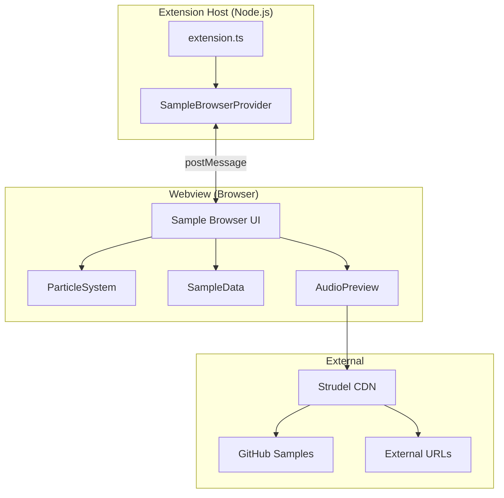

# Sample Browser - Design Document

## Overview

The Sample Browser is a new VS Code webview panel that provides a visual interface for discovering, previewing, and loading Strudel sample packs. It integrates with the existing Strudel Box architecture, reusing the particle system and theme infrastructure while adding new functionality for sample management.

The panel will be accessible from the Activity Bar alongside the existing Strudel Player, providing a dedicated space for sample exploration without cluttering the main editor interface.

## Architecture



### Key Design Decisions

1. **Separate Webview Panel**: The Sample Browser is a standalone WebviewViewProvider, not integrated into the existing Strudel Player. This keeps concerns separated and allows independent development.

2. **Shared Particle System**: Reuse the existing `particles.ts` code by embedding it directly in the webview HTML (same pattern as StrudelExplorerProvider).

3. **Client-Side Audio**: Audio preview uses the Strudel CDN directly in the webview, avoiding extension host audio complexity.

4. **Static Sample Data**: Sample pack metadata is defined in a TypeScript data file, making it easy to extend without UI changes.

## Components and Interfaces

### SampleBrowserProvider (Extension Host)

```typescript
// src/SampleBrowserProvider.ts
interface SampleBrowserProvider extends vscode.WebviewViewProvider {
  readonly viewType: 'strudel-box.sampleBrowser';
  
  resolveWebviewView(
    webviewView: vscode.WebviewView,
    context: vscode.WebviewViewResolveContext,
    token: vscode.CancellationToken
  ): void;
}
```

### Sample Pack Data Structure

```typescript
// Shared type definition
interface SamplePack {
  id: string;           // Unique identifier
  name: string;         // Display name
  url: string;          // The samples() URL
  category: SampleCategory;
  sampleCount?: number; // Optional, if known
  description?: string; // Optional description
  author?: string;      // Optional author/source
}

type SampleCategory = 
  | 'builtin'      // Strudel.cc built-in
  | 'github'       // GitHub repositories
  | 'external'     // External URLs
  | 'community';   // Community contributions

interface CategoryInfo {
  id: SampleCategory;
  name: string;
  icon: string;
  expanded: boolean;
}
```

### Webview State

```typescript
interface SampleBrowserState {
  theme: 'tech' | 'halloween' | '8bit';
  searchQuery: string;
  expandedCategories: SampleCategory[];
  loadedPacks: string[];  // IDs of loaded packs
  previewingPack: string | null;
}
```

### Message Protocol

```typescript
// Extension → Webview
type ExtensionMessage = 
  | { command: 'updateState'; payload: Partial<SampleBrowserState> }
  | { command: 'packLoaded'; payload: { packId: string; success: boolean; error?: string } }
  | { command: 'setTheme'; payload: string };

// Webview → Extension
type WebviewMessage =
  | { command: 'ready' }
  | { command: 'setTheme'; payload: string }
  | { command: 'loadPack'; payload: string }
  | { command: 'copyUrl'; payload: string };
```

## Data Models

### Sample Pack Registry

The complete sample pack list will be stored in a dedicated data file:

```typescript
// webview-ui/src/samplePackData.ts
export const SAMPLE_PACKS: SamplePack[] = [
  // Built-in
  { id: 'tidal-drum-machines', name: 'Tidal Drum Machines', url: 'tidal-drum-machines', category: 'builtin', sampleCount: 683 },
  { id: 'vcsl', name: 'VCSL', url: 'vcsl', category: 'builtin', sampleCount: 128 },
  // ... more packs
  
  // GitHub
  { id: 'dirt-samples', name: 'Dirt Samples', url: 'github:tidalcycles/Dirt-Samples', category: 'github', sampleCount: 218 },
  // ... more packs
];

export const CATEGORIES: CategoryInfo[] = [
  { id: 'builtin', name: 'Built-in Samples', icon: '📦', expanded: true },
  { id: 'github', name: 'GitHub Collections', icon: '🐙', expanded: false },
  { id: 'external', name: 'External URLs', icon: '🌐', expanded: false },
  { id: 'community', name: 'Community Packs', icon: '👥', expanded: false },
];
```

## Correctness Properties

*A property is a characteristic or behavior that should hold true across all valid executions of a system-essentially, a formal statement about what the system should do. Properties serve as the bridge between human-readable specifications and machine-verifiable correctness guarantees.*

### Property 1: Pack Rendering Completeness

*For any* valid sample pack in the data registry, when rendered, the output SHALL contain the pack name, a copy button element, and the source URL.

**Validates: Requirements 1.4, 2.3, 8.2, 8.3**

### Property 2: Category Grouping Correctness

*For any* sample pack with a defined category, the pack SHALL appear under the correct category heading when the list is rendered.

**Validates: Requirements 1.2**

### Property 3: Category Toggle State

*For any* category, clicking the category header SHALL toggle its expanded state from true to false or false to true.

**Validates: Requirements 1.3**

### Property 4: Copy Snippet Format

*For any* sample pack URL, the generated clipboard snippet SHALL be exactly `samples('${url}')` where `${url}` is the pack's URL.

**Validates: Requirements 2.1**

### Property 5: Search Filter Correctness

*For any* search query and sample pack list, the filtered results SHALL only contain packs where the query matches the pack name, category name, or URL (case-insensitive).

**Validates: Requirements 4.1, 4.2**

### Property 6: Empty Search Restoration

*For any* sample pack list, when the search query is empty, the filter function SHALL return all packs unchanged.

**Validates: Requirements 4.3**

### Property 7: Theme State Persistence

*For any* theme selection, saving and then restoring state SHALL preserve the selected theme.

**Validates: Requirements 5.4**

### Property 8: Playing State Indicator

*For any* pack in "previewing" state, the UI SHALL display a playing indicator, and for any pack not in previewing state, no playing indicator SHALL be shown.

**Validates: Requirements 3.2, 3.3**

### Property 9: Loaded State Display

*For any* pack in the "loaded" set, the UI SHALL display a "Loaded" badge instead of the load button.

**Validates: Requirements 7.2, 7.3**

### Property 10: Animation Lifecycle

*For any* visibility change to hidden/closed, the particle system's stop function SHALL be called.

**Validates: Requirements 6.3**

## Error Handling

### Sample Loading Failures

- Network errors: Display "Failed to load: Network error" with retry option
- Invalid URL: Display "Invalid sample URL" 
- Timeout: After 10 seconds, display "Loading timed out" with retry option

### Audio Preview Failures

- AudioContext suspended: Prompt user to click to enable audio
- Sample not found: Display "Sample not available for preview"
- Playback error: Log to console, show brief error toast

### State Persistence Failures

- Invalid saved state: Reset to defaults, log warning
- Storage quota exceeded: Continue without persistence, log warning

## Testing Strategy

### Property-Based Testing

The implementation will use **fast-check** for property-based testing in TypeScript.

Each property-based test will:
- Run a minimum of 100 iterations
- Be tagged with the format: `**Feature: sample-browser, Property {number}: {property_text}**`
- Reference the specific correctness property from this design document

### Unit Tests

Unit tests will cover:
- Sample pack data validation
- URL snippet generation
- Search/filter logic
- State serialization/deserialization

### Integration Tests

- Webview message passing
- Theme switching
- Clipboard operations (mocked)

### Test File Structure

```
webview-ui/src/
├── sampleBrowser.ts
├── sampleBrowser.test.ts      # Unit tests
├── sampleBrowser.property.test.ts  # Property-based tests
├── samplePackData.ts
└── samplePackData.test.ts
```
